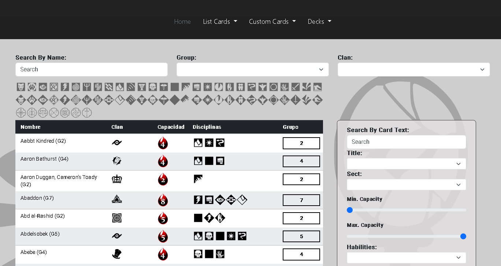
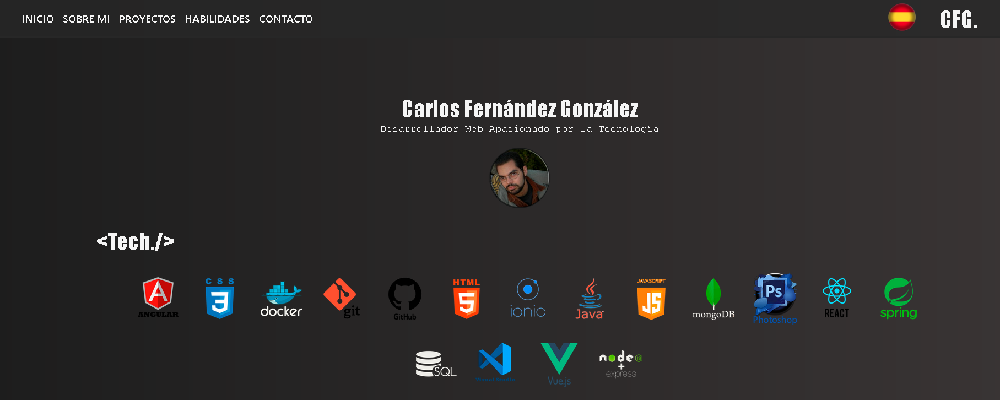

# 👋 ¡Hola! Soy Carlos

### 👨‍💻 Sobre mí
¡Hola! Soy Carlos Fernández González, un **Desarrollador Web Full Stack** con experiencia en desarrollo front-end y back-end usando tecnologías como Angular, Vue, Node.js, Java con Spring Boot. Tengo experiencia trabajando con metodologías ágiles (SCRUM), control de versiones (Git) y buenas prácticas de accesibilidad. Me apasiona crear aplicaciones escalables, eficientes, fáciles de mantener y centradas en el usuario.

📱 **Teléfono:** 635 30 78 94  
📧 **Email:** c6rlosfern6ndez@gmail.com  
🌐 **Portafolio:** [https://portafolios-blond.vercel.app/](https://portafolios-blond.vercel.app/)  
🚀 **Proyectos:** [https://whejhe.github.io/](https://whejhe.github.io/)

---

### 🎓 Formación
- **2024-2025:** Técnico Superior en Desarrollo de Aplicaciones Multiplataforma - IES Velázquez (Sevilla)
- **2025:** Ciberseguridad Avanzada en entornos de las tecnologías de la operación (FPE) - Aprendea (Formación online)
- **2022-2024:** Técnico Superior en Desarrollo de Aplicaciones Web - IES Sotero Hernández (San Juan de Aznalfarache, Sevilla)
- **2020-2021:** Grado Medio de Microinformática y Redes - Centro Ilerna (Sevilla)
- **2018:** FPE Confección y Publicación de Páginas Web (HTML, CSS y WordPress) - Formatec (Mairena del Aljarafe, Sevilla)

---

### 💼 Experiencia Profesional
- **QUANTUM SOLUTIONS** (Sevilla) - Desarrollador Web | *17/03/2025 – 13/06/2025*
  - Implementé partes de la interfaz de usuario usando HTML5, CSS y JavaScript, enfocada en compatibilidad y accesibilidad
  - Realicé pruebas de rendimiento que mejoraron los tiempos de carga y la experiencia de usuario
  - Apliqué buenas prácticas WAI-ARIA para accesibilidad web
  - Coordiné versiones y colaboraciones en equipo mediante Git y GitHub

- **SOFTCOM** (Mairena del Aljarafe, Sevilla) - Desarrollador Web | *28/11/2023 – 14/06/2024*
  - Desarrollé nuevas funcionalidades y mantenimientos con Angular, Node.js y MongoDB
  - Participé en reuniones diarias y entregas, asegurando continuidad en el flujo de desarrollo
  - Propuse y apliqué mejoras que redujeron la complejidad del frontend
  - Gestioné ramas y pull requests con Git y GitHub

- **SOFTCOM** (Mairena del Aljarafe, Sevilla) - Desarrollador Web | *08/03/2023 – 09/06/2023*
  - Implementé vistas dinámicas con Vue 3 y conecté servicios backend con Node.js y SQL Server
  - Contribuí a la depuración de errores críticos en producción, mejorando la estabilidad del sistema
  - Trabajé en un flujo de CI/CD junto al equipo técnico

- **NTT DATA** (Sevilla) - Desarrollador Web | *08/03/2022 – 09/06/2022*
  - Desarrollé endpoints REST con Java (Spring Boot) y SQL Server, asegurando seguridad y eficiencia
  - Participé en el diseño de base de datos y pruebas unitarias
  - Adquirí experiencia práctica con metodologías de trabajo de grandes consultoras tecnológicas

---

### 🌟 Mis proyectos destacados
1. **[Parte Front de mi proyecto final en DAW](https://front-vtes.vercel.app/)**
   - Una aplicación para gestionar la creacion de mazos, torneos y cartas pesonalizadas.
   - Tecnologías utilizada:
      - Frontend: Angular
      - Backend: Node.js y MongoDB
      - Otros: Bootstrap para estilos.
   **[Por si quieres consultar el backend](https://github.com/whejhe/vtes-backend)**
   
   
3. **[Portafolio](https://portafolios-blond.vercel.app/)**  
   Aún esta construcción... 
   

---

### 🛠️ Tecnologías y herramientas

#### 💻 **Lenguajes de Programación**

  
  
  
  
  
  
  
  

#### 🎨 **Frontend**

  
  
  
  
  
  

#### ⚙️ **Backend**

  
  
  

#### 🗄️ **Bases de Datos**

  
  
  
  

#### 🛠️ **Herramientas y Control de Versiones**

  
  
  
  

#### 🔧 **Otras Competencias**
- **Metodologías:** SCRUM, CI/CD
- **Accesibilidad:** WAI-ARIA, Responsive Design
- **Sistemas Operativos:** Windows, Linux
- **Idiomas:** Inglés (Nivel Intermedio)

---

### 🌐 Conéctate conmigo
- 📧 [c6rlosfern6ndez@gmail.com](mailto:c6rlosfern6ndez@gmail.com)
- 💼 [LinkedIn](https://www.linkedin.com/in/carlos-fernandez-gonzalez-a1025b263/)

---

### ✨ Mis valores y objetivos
- 🚀 Innovar con cada proyecto que creo.
- 🤝 Fomentar el aprendizaje colaborativo.
- 🌱 Aprender constantemente para estar al día con las últimas tecnologías.

---

### 🌟 Estadísticas de GitHub

---

### 🤝 ¿Colaboramos?
Estoy buscando contribuir a proyectos interesantes y colaborar con otros desarrolladores. Si tienes alguna idea o proyecto, ¡escríbeme!  
📧 c6rlosfern6ndez@gmail.com
